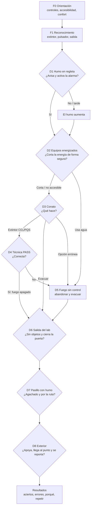

# Diagrama de flujo – URBIS VR

Se ve en VS Code con una extensión de Mermaid o en https://mermaid.live. Luego se pasa a Figma.

```mermaid
flowchart TD
    F0[F0 Orientación<br/>controles, accesibilidad, confort] --> F1[F1 Reconocimiento<br/>extintor, pulsador, salida]
    F1 --> D1{D1 Humo en regleta<br/>¿Avisa y activa la alarma?}
    D1 -->|Sí| D2
    D1 -->|No / tarde| D1x[El humo aumenta] --> D2
    D2{D2 Equipos energizados<br/>¿Corta la energía de forma segura?}
    D2 -->|Corta / no accesible| D3
    D2 -->|Usa agua| D5
    D3{D3 Conato<br/>¿Qué hace?}
    D3 -->|Extintor CO₂/PQS| D4
    D3 -->|Evacuar| D6
    D3 -->|Opción errónea| D5
    D4{D4 Técnica PASS<br/>¿Correcta?}
    D4 -->|Sí: fuego apagado| D6
    D4 -->|No| D5
    D5[D5 Fuego sin control<br/>abandonar y evacuar] --> D6
    D6{D6 Salida del lab<br/>¿Sin objetos y cierra la puerta?}
    D6 --> D7{D7 Pasillo con humo<br/>¿Agachado y por la ruta?}
    D7 --> D8{D8 Exterior<br/>¿Apoya, llega al punto y se reporta?}
    D8 --> R[Resultados<br/>aciertos, errores, porqué, repetir]
```
